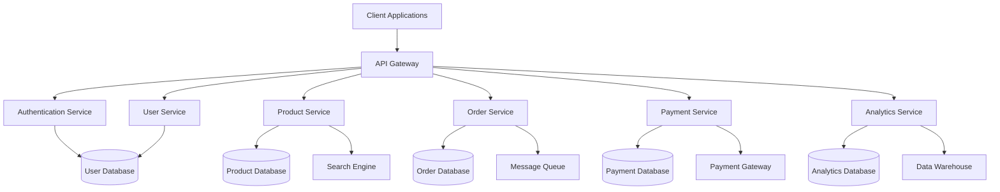

# 🎓 Course Capstone Project

This module serves as the final project for the course, bringing together all the concepts and skills learned throughout the program. Students will design and implement a complete backend system, applying best practices in architecture, security, performance, and deployment. Think of this capstone project as the culmination of your learning journey—a chance to showcase your mastery of backend engineering principles.

## 🎯 Learning Goals
- Design and implement an end-to-end backend system  
- Analyze real-world requirements and constraints  
- Document system architecture and design decisions  
- Conduct performance testing and optimization  
- Perform security assessment and secure deployment  

---

## 📋 Project Overview

### E-Commerce Platform

Design and implement a scalable e-commerce platform with the following features:

**Key Features:**  
- **User Management:**  
  - Authentication and authorization ensure only authorized users can access resources.  
  - User profiles and preferences enable personalized experiences.  
  - Role-based access control (RBAC) restricts actions based on user roles.  

- **Product Management:**  
  - A product catalog displays available items.  
  - Inventory management tracks stock levels and prevents overselling.  
  - Search and filtering enhance discoverability for users.  

- **Order Processing:**  
  - A shopping cart allows users to collect items before checkout.  
  - The checkout process handles payment and order confirmation.  
  - Order tracking provides visibility into delivery status.  

**Anti-Pattern:**  
Relying solely on synchronous operations during checkout can lead to bottlenecks under heavy load.

- **Payment Processing:**  
  - Multiple payment methods cater to diverse user preferences.  
  - Transaction management ensures consistency across systems.  
  - Refund handling provides flexibility for returns and cancellations.  

**Do’s and Don’ts:**  
- **Do:** Use PCI-compliant payment gateways to protect sensitive data.  
- **Don’t:** Store raw credit card information—it’s a major security risk.

- **Analytics and Reporting:**  
  - Sales analytics provide insights into revenue trends.  
  - User behavior tracking helps optimize the platform.  
  - Performance metrics monitor system health and scalability.  

> **🧠 Decision Framework:**  
> Choose analytics tools based on data volume, retention needs, and visualization capabilities.

---

## 🏗️ System Design

### Architecture Diagram

The architecture diagram illustrates how components interact to deliver the platform’s functionality.



**Key Features:**  
- **API Gateway:** Acts as the entry point for client requests, routing them to appropriate services.  
- **Microservices:** Each service focuses on a specific domain (e.g., authentication, products).  
- **Databases:** Separate databases for each service ensure scalability and modularity.  

**🤔 Misconception:**  
Some believe monolithic architectures are inherently bad. \
**Reality:** While microservices offer benefits, they also introduce complexity that must be managed.

---

### Technology Stack

1. **Backend Services:**  
   - **Node.js with Express:** Enables rapid development of RESTful APIs.  
   - **TypeScript:** Adds type safety, reducing runtime errors.  
   - **MongoDB:** Provides flexible schema design for unstructured data.  
   - **Redis:** Enhances performance through caching.  
   - **Elasticsearch:** Powers fast and accurate search capabilities.  
   - **RabbitMQ:** Facilitates asynchronous communication between services.  

2. **Infrastructure:**  
   - **Docker:** Simplifies containerization, making deployments consistent.  
   - **Kubernetes:** Automates scaling, load balancing, and self-healing.  
   - **AWS:** Offers reliable cloud services for hosting and storage.  
   - **Terraform:** Enables infrastructure as code for reproducibility.  

3. **Monitoring and Logging:**  
   - **Prometheus & Grafana:** Track metrics and visualize performance.  
   - **ELK Stack:** Centralizes logs for analysis and troubleshooting.  
   - **Jaeger:** Provides distributed tracing for debugging.  

> **🧠 Analogy:**  
> The technology stack is like a toolbox—each tool has a specific purpose, and using the right one ensures success.

---

## 📝 Implementation Guidelines

### 1. Project Setup

Setting up the project involves creating a structured directory layout and initializing services.

```bash
# Create project structure
mkdir ecommerce-platform
cd ecommerce-platform

# Initialize services
mkdir -p services/{auth,user,product,order,payment,analytics}
mkdir -p infrastructure/{docker,kubernetes,terraform}
mkdir -p docs/{architecture,api,deployment}

# Initialize each service
for service in auth user product order payment analytics; do
    cd services/$service
    npm init -y
    npm install typescript @types/node ts-node
    npx tsc --init
    cd ../..
done
```

**Do’s and Don’ts:**  
- **Do:** Keep the project structure modular for clarity and maintainability.  
- **Don’t:** Mix concerns—separate business logic, infrastructure, and documentation.

---

### 2. Service Implementation

Each service should encapsulate its functionality while adhering to best practices.

**Example:**  
A product service might expose endpoints for listing, searching, and updating products. It would interact with a database for persistence and a message queue for inventory updates.

---

### 3. API Documentation

API documentation ensures that frontend developers and other stakeholders understand how to interact with the backend.

**Best Practices:**  
- Use OpenAPI/Swagger to define endpoints, request/response schemas, and error codes.  
- Include examples for common use cases.  

> **⚠️ Anti-Pattern:**  
> Neglecting API documentation leads to confusion and inefficiencies during integration.

---

### 4. Performance Testing

Performance testing validates the system’s ability to handle expected loads without degradation.

**Key Metrics:**  
- Response times under peak traffic.  
- Throughput (requests per second).  
- Error rates during stress tests.  

> **🧠 Analogy:**  
> Performance testing is like stress-testing a bridge—you identify weak points before opening it to traffic.

---

### 5. Security Assessment

Security assessments ensure the platform protects user data and complies with regulations.

**Checklist:**  
- Encrypt sensitive data in transit and at rest.  
- Implement rate limiting to prevent abuse.  
- Regularly update dependencies to patch vulnerabilities.  

**Do’s and Don’ts:**  
- **Do:** Use industry-standard encryption protocols (e.g., TLS).  
- **Don’t:** Expose internal APIs publicly without proper authentication.

---

## 📝 Project Deliverables

1. **System Architecture Documentation:**  
   - Include diagrams, justifications for technology choices, and trade-offs.  

2. **API Documentation:**  
   - Provide OpenAPI specifications, authentication details, and examples.  

3. **Implementation:**  
   - Share source code, Docker configurations, Kubernetes manifests, and Terraform scripts.  

4. **Testing Documentation:**  
   - Report unit test coverage, integration results, performance metrics, and security findings.  

5. **Deployment Guide:**  
   - Outline environment setup, deployment steps, monitoring configuration, and maintenance procedures.  

---

## 📝 Quiz

1. How would you approach the design of a scalable e-commerce platform? What are the key considerations?  
   - **Hint:** Discuss microservices, database sharding, and caching strategies.

2. What security measures would you implement to protect user data and payment information?  
   - **Hint:** Address encryption, authentication, and compliance.

3. How would you ensure high availability and performance under heavy load?  
   - **Hint:** Focus on load balancing, auto-scaling, and caching.

4. What monitoring and alerting strategies would you implement for the platform?  
   - **Hint:** Highlight metrics, logs, and distributed tracing.

---

## 🎯 Course Conclusion

Congratulations on completing the Backend Engineering Course! You've now mastered the essential concepts, patterns, and technologies needed to build robust, scalable, and maintainable backend systems. The capstone project serves as a practical demonstration of your skills and knowledge. Remember that backend engineering is a continuously evolving field, and staying current with new technologies and best practices is crucial for long-term success.

---

[⬅️ Previous: Emerging Technologies](34-emerging-technologies.md) | [⬅️ Back to Course Index](README.md)
