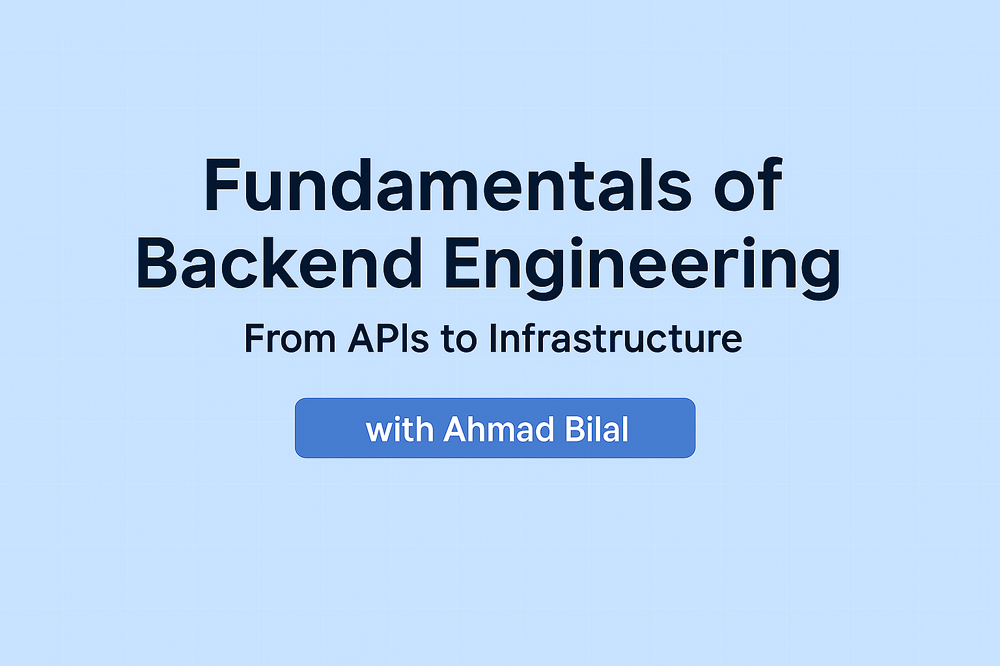

# 🚀 Fundamentals of Backend Engineering: From Apis to Infrastructure

A comprehensive course covering the complete backend request lifecycle, from DNS resolution to database interaction, infrastructure management, and system design patterns.

## 👨‍💻 Meet Your Instructor

Hello! I'm **Ahmad Bilal**, a Senior Full Stack Engineer with over 5 years of hands-on experience. I specialize in architecting and deploying secure, scalable backend systems and cloud infrastructure, with a strong focus on DevOps practices. My passion is helping engineers bridge the gap between theory and real-world application—so you can build systems that are robust, efficient, and ready for scale.

I'm excited to guide you through this course and share the insights, lessons, and best practices I've learned in the field. Let's level up your backend engineering skills together!

🔗 **Learn more about me and my work** → [Visit my portfolio](https://ahmad-bilal.vercel.app)

## 📚 Course Overview

This course is designed for intermediate to advanced developers who want to master backend engineering. You'll learn everything from fundamental concepts to advanced patterns, with a focus on practical implementation and real-world scenarios.

🎯 **Ultimate Learning Goal**:  
Understand how a client request flows end-to-end:  
`DNS → TLS → HTTP → reverse proxy → API layer → service → DB → infra → response` 

...and design systems that are: \
✅ Scalable  
✅ Secure  
✅ Maintainable  
✅ Observable

## 🧠 Ace Your Interviews with Confidence

Whether you're preparing for system design interviews, backend engineering roles, or infrastructure-focused positions — this course has your back!

It’s designed not just to teach **what** works, but **why**, with:

- 📘 **Conceptual explanations** of core systems  
- ✅ **Do’s and Don’ts** based on real-world engineering  
- ⚖️ **Trade-offs and design choices** explained clearly  
- 🧠 **Analogies** to simplify complex concepts  
- 🛠️ **Implementation examples** and architectural patterns  
- 🤯 **Common misconceptions** debunked so you don’t fall for traps  
- 💬 **Interview-style thinking** built into every module  

Whether you're answering a system design prompt or explaining a database trade-off — you'll walk in with confidence, clarity, and context.

> 🎯 This course is not just for learning — it’s for leveling up and landing offers.

## 🧠 Prerequisites

- 🧑‍💻 Basic understanding of programming concepts  
- 🔤 Familiarity with JavaScript/Node.js or similar language  
- 🌐 Basic knowledge of web development  
- 📡 Understanding of HTTP and REST APIs  

## 📑 Course Structure
### 🔁 Part 1: Request Lifecycle Fundamentals  
**Following the actual request path from client to server**

#### 📡 Module 1: [Backend System Overview](01-backend-system-overview.md)
#### 🌐 Module 2: [DNS Resolution & Network Routing](02-dns-resolution-network-routing.md)
#### 🔒 Module 3: [Transport Layer Security (TLS)](03-transport-layer-security.md)
#### 📥 Module 4: [HTTP Protocol Deep Dive](04-http-protocol-deep-dive.md)

---

### ⚙️ Part 2: Infrastructure & Traffic Management  
**How requests are distributed and managed at infrastructure level**

#### 📊 Module 5: [Load Balancers & Reverse Proxies](05-load-balancers-reverse-proxies.md)
#### 🚦 Module 6: [API Gateway & Request Processing](06-api-gateway-request-processing.md)

---

### 🛠️ Part 3: API Layer & Service Design  
**How requests are parsed, validated, and processed**

#### 🧩 Module 7: [API Design & Protocols](07-api-design-protocols.md)
#### 🧼 Module 8: [Request Parsing & Validation](08-request-parsing-validation.md)
#### 🔐 Module 9: [Authentication & Authorization](09-authentication-authorization.md)

---

### 🧬 Part 4: Service Layer & Business Logic  
**How business logic is implemented and organized**

#### 🧱 Module 10: [Service Architecture Patterns](10-service-architecture-patterns.md)
#### 🧠 Module 11: [Business Logic Implementation](11-business-logic-implementation.md)
#### 🛰️ Module 12: [Inter-Service Communication](12-inter-service-communication.md)

---

### 🗄️ Part 5: Data Layer & Persistence  
**How data is stored, retrieved, and managed**

#### 🧮 Module 13: [Database Design & Selection](13-database-design-selection.md)
#### ⚙️ Module 14: [Database Operations & Optimization](14-database-operations-optimization.md)
#### 🧊 Module 15: [Caching Strategies](15-caching-strategies.md)

---

### ⏳ Part 6: Asynchronous Processing & Events  
**How background work and events are handled**

#### 📬 Module 16: [Message Queues & Event Systems](16-message-queues-event-systems.md)
#### ⏰ Module 17: [Background Jobs & Scheduling](17-background-jobs-scheduling.md)
#### 🧾 Module 18: [Event Sourcing & CQRS](18-event-sourcing-cqrs.md)

---

### 📈 Part 7: Scalability & Performance  
**How systems scale and perform under load**

#### 📊 Module 19: [Horizontal & Vertical Scaling](19-horizontal-vertical-scaling.md)
#### 🚀 Module 20: [Performance Optimization](20-performance-optimization.md)
#### 💡 Module 21: [High Availability & Resilience](21-high-availability-resilience.md)

---

### 🔐 Part 8: Security & Compliance  
**How systems are secured and protected**

#### 🛡️ Module 22: [Application Security](22-application-security.md)
#### 🧱 Module 23: [Infrastructure Security](23-infrastructure-security.md)
#### 📜 Module 24: [Compliance & Governance](24-compliance-governance.md)

---

### 🚢 Part 9: DevOps & Infrastructure  
**How systems are deployed and managed**

#### 📦 Module 25: [Containerization & Orchestration](25-containerization-orchestration.md)
#### 🔄 Module 26: [CI/CD & Deployment](26-cicd-deployment.md)
#### 🧰 Module 27: [Configuration & Environment Management](27-configuration-environment-management.md)

---

### 🔍 Part 10: Observability & Monitoring  
**How systems are monitored and debugged**

#### 📑 Module 28: [Logging & Metrics](28-logging-metrics.md)
#### 🧵 Module 29: [Distributed Tracing](29-distributed-tracing.md)
#### 🚨 Module 30: [Alerting & Incident Response](30-alerting-incident-response.md)

---

### ✅ Part 11: Testing & Quality Assurance  
**How systems are tested and quality is ensured**

#### 🧪 Module 31: [Testing Strategies](31-testing-strategies.md)
#### 🧹 Module 32: [Code Quality & Standards](32-code-quality-standards.md)

---

### 🌟 Part 12: Advanced Topics & Emerging Trends  
**Advanced patterns and future technologies**

#### 🧬 Module 33: [Advanced Architectural Patterns](33-advanced-architectural-patterns.md)
#### 🧠 Module 34: [Emerging Technologies](34-emerging-technologies.md)
#### 🏁 Module 35: [Course Capstone Project](35-course-capstone-project.md)

---

## 🛣️ Learning Path Recommendations

Choose your journey based on your goals 🎯:

### 🚀 Track 1: Full-Stack Backend Engineer
All 35 modules — for comprehensive backend mastery.

### 🧪 Track 2: API & Service Developer  
Focus on:
- Modules 1–4: Fundamentals  
- Modules 7–12: API & services  
- Modules 31–32: Testing & quality

### 🛠️ Track 3: Infrastructure & DevOps  
Focus on:
- Modules 1–2: Foundations  
- Modules 5–6: Traffic & infra  
- Modules 25–30: CI/CD & monitoring

### 💾 Track 4: Database & Performance Specialist  
Focus on:
- Modules 1, 13–21, 28–30  
- Data modeling, scaling, performance optimization

---
## 🏁 Ready to Begin?
Start with 👉 [Backend System Overview](01-backend-system-overview.md)  
...or pick any module above that excites you. 

Happy learning! 🚀 

---
## 🤝 Contributing

Open to suggestions, ideas, and PRs! If you’ve found a bug or want to add something awesome, feel free to contribute. 🔧

## 📄 License

This course is licensed under the MIT License - see the [License](LICENSE) for details.